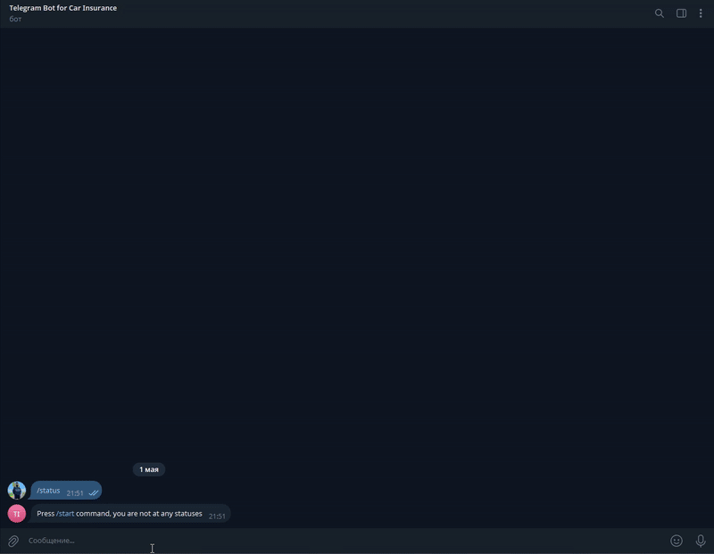
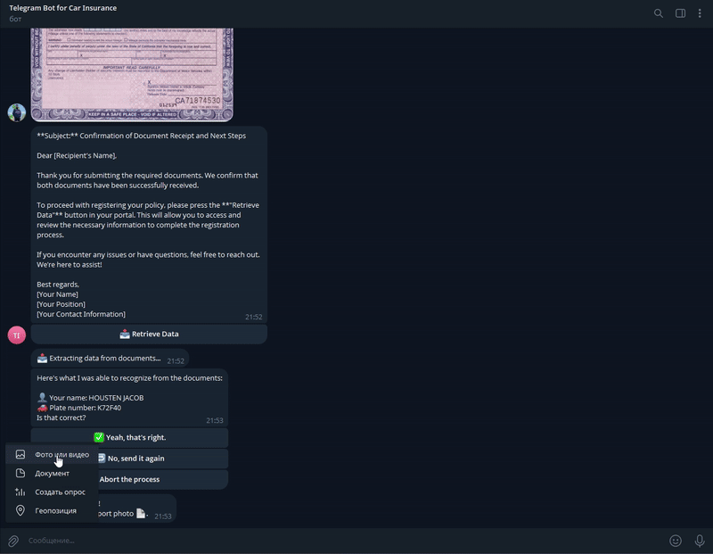

# 🚗 Telegram Bot For Car Insurance 

This Telegram bot helps users to purchase car insurance using OCR and AI-powered conversation.
It extracts relevant data from uploaded passport and vehicle registration documents, interacts with users via natural language, and generates a draft insurance policy.

## 📦 Features

- 📸 Accepts photos of a passport and vehicle registration certificate
- 🧠 Extracts user name and car plate number using OCR and NLP
- 🤖 Communicates using a "Cohere" LLM model
- 💰 Calculates an insurance policy price and suggests companies
- 📃 Generates a text of the insurance policy

## 🚀 Installation and Run

1. Clone the repository:
   ```bash
    git clone https://github.com/LobiSZ9Iblami/car-insurance-name.git
    cd car-insurance-name # Or any you directory name
   ```

2. Install dependencies:
   ```bash
   pip install -r requirements.txt
   ```

3. Create a file `bot_config.py` with the following content:
   ```python
   bot_key = "<YOUR_TELEGRAM_BOT_TOKEN>"
   HUGGIN_API_KEY = "<YOUR_HUGGINGFACE_API_KEY>"
   ```

4. Run the bot:
   ```bash
   python telegram_bot.py
   ```

## 🧠 Technologies Used

- **Aiogram** — for building Telegram bot
- **Cohere LLM** — for dialogue and policy text generation
- **Presidio Analyzer** — for entity recognition (car number)
- **FSM (Finite State Machine)** — for managing user flow

## 📎 Bot Commands

- `/start` — begin insurance process
- `/exit` — exit process
- `/status` — check current state

## 📁 Project Structure

```
project/
├── telegram_bot.py          # Main bot logic
├── mindee_doc_model.py      # OCR and entity extraction
├── bot_AI.py                # AI-generated replies and policy
├── keyboards.py             # inline buttons for interaction
├── bot_config.py            # API keys (not in version control)
├── price_calculation.py     # API for insurance price calculation
└── requirements.txt         # Python dependencies
```

## ✅ Sample Flow

1. User sends passport photo
2. Bot: “Thanks, now send the vehicle registration certificate”
3. User sends the second photo
4. Bot extracts name and car number, confirms them with user
5. Bot calculates policy price and proposes insurance options

---

## Video example
#### First 60 seconds

#### Second 60 seconds
